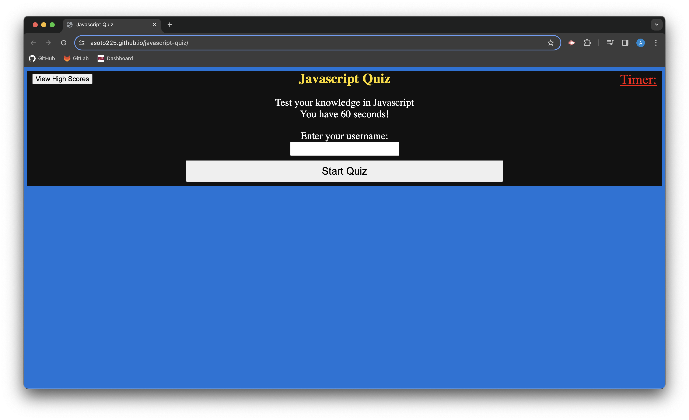

# javascript-quiz

## Table of Contents
1. [Description](#description)
2. [Installation](#installation)
3. [Usage](#usage)
4. [License](#license)
5. [Screenshot](#screenshot)
6. [Questions](#questions)

## Description
This project was aimed towards creating a short quiz that tests your knowledge on Javascript Topics. The application was created using HTML, CSS, and Javascript. 

## Usage 
To use this application, please navigate to the active website at https://asoto225.github.io/javascript-quiz/ .Once on the website, enter a user name and click "start quiz". The user will have 60 seconds to answer a series of questions about Javascript. Once the timer has run out or all the questions have been completed, the user's score is calculated and displayed. The user can check the high scores by clicking on the "view high scores" button on the top left hand corner. 

## License 
Please refer to the license in the GitHub Repository.

## Screenshot

## Questions 
You can find me [HERE](https://github.com/asoto225) on Github or
you can email me at abelsoto12@hotmail.com if you have any additional questions.